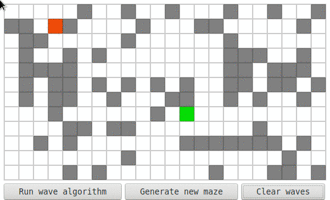

# wave-algo  
Lee's algorithm finds the shortest path between 2 points in a 2D matrix. It is also called Wave algorithm.

## Demo
Try [demo](https://kubk.github.io/wave-algo/build) in your browser. You can change start/finish position using left/right click.

## Example

## Installation
1. Clone this repo using `git clone`
2. Run `npm start` in the project root folder

## Testing
Run `npm test`

## Browser support
- Firefox 48+
- Chrome 51+
